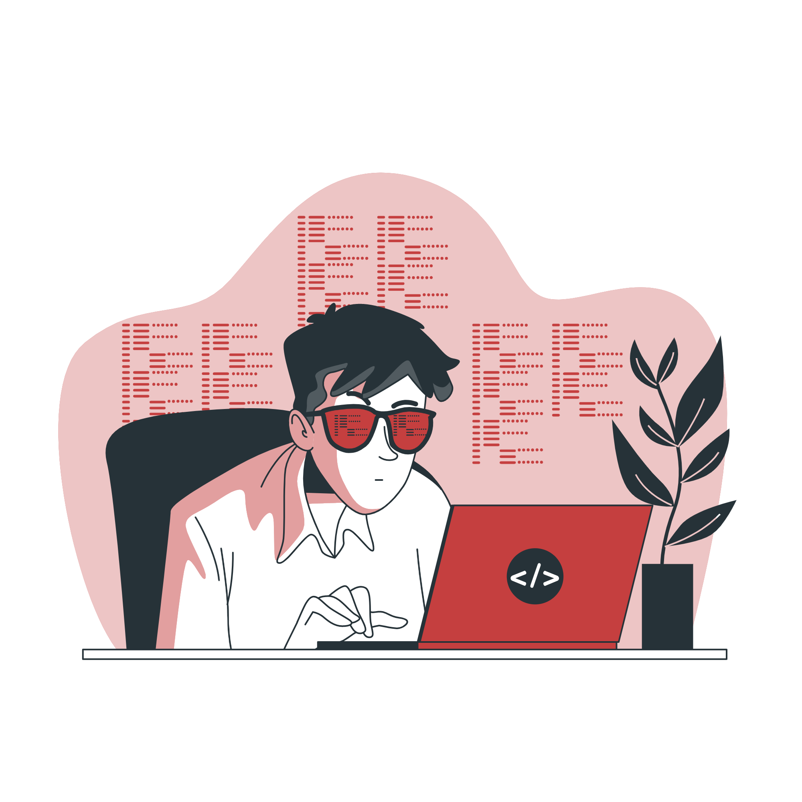

# **Richard Tsai**

## Just another CS tinkerer
 * Located in NYC
 * Interests: Cybersecurity, devops, fullstack
 * Certification: ISC2 CISSP, CompTIA Security+, AWS Certified Security  

## What you been up to?
 * Working at PSEG LI streamlining and securing pipelines
 * Currently tinkering homelab

## Skills
* Main Languages: C++, Java, C, Python, JS, TS
* Others: Git, Docker, NGINX, Linux, Kubernetes
