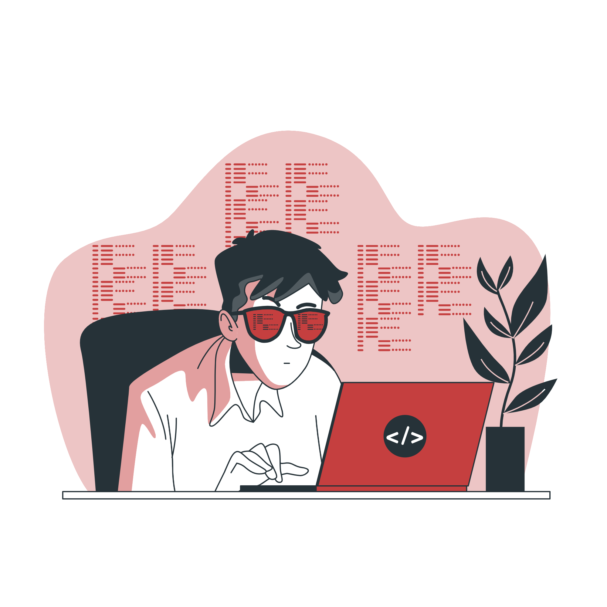

# **Richard Tsai**

## Just another CS tinkerer
 * Located in NYC
 * Interests: Cybersecurity, devops, fullstack
 * Certification: CompTIA Security+  

## What you been up to?
 * Currently project lead of [YACS.N](https://github.com/YACS-RCOS/yacs.n)
 * Developing and improving [Lil Tim](https://github.com/RichtXO/Lil-Tim)
 * Enjoying the little time off after graduation :D

## Skills
* Main Languages: C++, Java, C, Python, JS, TS
* Others: Git, Docker, NGINX, Linux, Kubernetes
